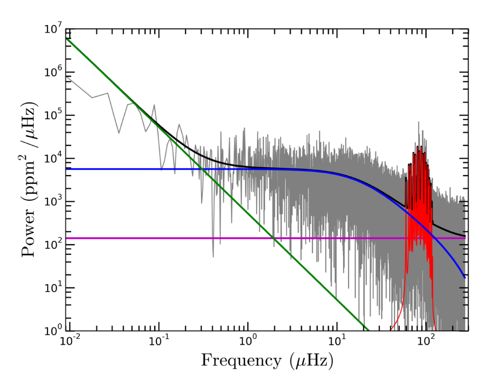

# grannules

A package for predicting granulation light variability parameters of red
giant stars.

Red giant power spectra generally look like Figure 4 of de Assis Peralta et al. 2018[^1]:

The blue curve represents the component of the spectrum originating from
the granulation of the star. In other words, the light variability
caused by the appearance and disappearance of \"granules,\"
convection cells on the star\'s photosphere. The red curve represents
the component of the spectrum originating from stellar oscillations.

Red giant asteroseismologists usually focus on the signal received from
the star, (the spikes of the red curve) whose properties have tight
relations with the physical properties of the star. However,
understanding the background components of these power spectra could
also prove useful.

The granulation component is described by

$$G(\nu) = \frac{P}{1 + (2 \pi \tau \nu)^\alpha}$$

and the overall shape of the oscillations component (ignoring the signal
spikes) by a Gaussian function of the following form

$$O(\nu) = H \exp \left[ \frac{- (\nu - \nu_\mathrm{max})^2}{\delta \nu_\mathrm{env}^2 / 4 \ln 2} \right]$$

where $H$ is the height of the gaussian envelope, $P$ is the height of the 
granulation evelope, $\tau$ is the timescale of granulation, $\alpha$ is the
slope of the granulation envelope, and $\delta \nu_\mathrm{env}$ is the FWHM of
the gaussian, which we take to be
$\delta \nu_\mathrm{env} = 0.66 \nu_\mathrm{max}^{0.88}$[^1],[^2].
$H, P, \tau,$ and $\alpha$ are usually fitted parameters. There exist scaling
relations for these values, but they are not accurate enough for practical 
use[^1].

This is where `grannules` comes in. This Python package is essentially a
wrapper around a neural network that, given a star\'s mass, radius,
temperature, luminosity, and evolutionary phase, can predict that
star\'s background parameters more accurately than the existing
scaling relations.

## How to install

To install from a local copy, you first might want to create a fresh environment
using whatever environment manager you prefer.

    $ conda create -n grannules

Then,

    $ git clone https://github.com/andres-luengo/grannules
    $ cd grannules
    $ pip install .

## Streamlit Web App

[Check out the Streamlit App based on this code!](https://grannules.streamlit.app)

To run this app locally,

    $ cd /path/to/grannules
    $ streamlit run webapp/main.py # must be run from root of grannules directory for images to work

[^1]: [de Assis Peralta, R., et al. 2018](https://doi.org/10.48550/arXiv.1805.04296)

[^2]: [Mosser et al. 2012](https://doi.org/10.1051/0004-6361/201117352)