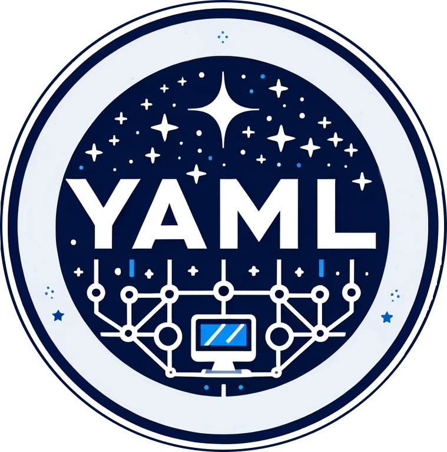

=======
Credits
=======

This package was developed as my final project for ASTR 330: Scientific 
Computing in Astrophysics at Yale University.

* **Lead Developer:** Andrés Eduardo Luengo Rodriguez 
  `Email <mailto:andres.luengo@yale.edu>`_ 
  `Github <https://github.com/andres-luengo>`_
* **Project Collaborator:** Irmak Akdogan
  `Email <mailto:irmak.akdogan@yale.edu>`_
* **PI:** Earl Patrick Bellinger 
  `Email <mailto:earl.bellinger@yale.edu>`_ 
  `Github <https://github.com/earlbellinger>`_

